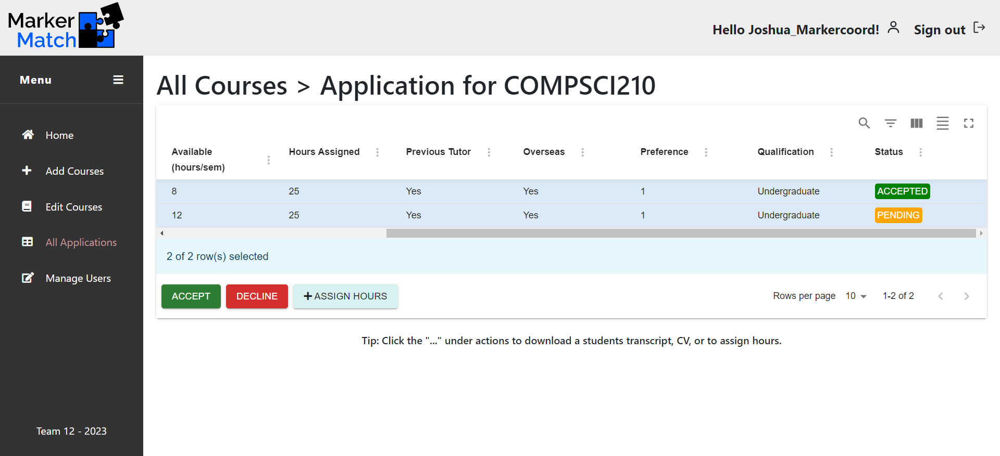

# MarkerMatch

### Deployed at: https://markermatchcapstonelambda12.web.app/home 

## Team Members:
* Nicholas Wu
* Bruno William 
* Matthew Tom
* Joshua Coleman
* Ieva Ruikyte

## Project Description

MarkerMatch is a web application designed to streamline the process of gathering markers for the computer science department at the University of Auckland. It unites students, course coordinators, and marker coordinators into one platform. Students can see a catalog of courses that they can apply to become markers for. Course coordinators can edit the course requirements (of courses they are responsible for); marker coordinators have no restrictions. They can see each application as well as be able to add, remove, and edit each course in the system.

## Planning

Our team used various ways of communicating. One of the main methods of keeping track of work done was used through Trello. For a specific breakdown in tasks, please refer to https://trello.com/b/seMhFLHF/agile-board-compsci-399-lambda-operators-trello.

## Development

### Hosting Technologies:
* AWS EC2 (Default backend)
* AWS Lambda (Serverless backend / relegated backend)
* AWS Amplify (Frontend)
* Firebase (Frontend Deployment)

### Frontend Technologies:
* React v18.2.0

### Backend Technologies:
* JavaScript
  * Nodejs v18.17.1
* AWS RDS (Relational Database Service)
* AWS SDK 
* AWS S3
* AWS Cognito

## Setting Up

* Clone repository to local machine
`git clone https://github.com/uoa-compsci399-s2-2023/capstone-project-team-12.git`
* open the command line, navigate to the local repository (i.e., cd capstone-project-team-12, followed by cd markermatch).
* run `npm install`
* ensure amplify is installed globally on your device (npm install -g @aws-amplify/cli)
* run `amplify pull --appId d2bpa4axdi2900 --envName staging`. Ensure you sign in to an account with team 12 privileges on AWS (The website will not function properly on your local machine in the absence of an AWS account with necessary permissions).
* run `npm start`

* Alternatively, the entire project has been hosted at https://markermatchcapstonelambda12.web.app/, with all dependencies installed and settings configured (the website is the exact copy of the copy on GitHub). **If you notice that no courses are loading on the homepage, please refresh the page as the database may be in a cold-start period, and may take a few moments to 'wake up'.**

### Here is an example of the dependencies used in the development of this project. For a full list, please check the package.json file in the project folder.
* @aws-amplify/ui-react: ^5.3.0,
* @aws-sdk/client-cognito-identity-provider: ^3.427.0,
* @aws-sdk/client-sts: 3.427.0,
* @aws-sdk/credential-providers: ^3.427.0,
* @emotion/react: ^11.11.1,
* @fortawesome/react-fontawesome: ^0.2.0,
* @mui/material: ^5.14.9,
* @aws-amplify: ^5.3.11,
* @bootstrap: ^5.3.1,
* @cdbreact: ^1.5.18,
* @react: ^18.2.0

## Application Examples
### Home Page - Entry for all users:

### Application Status page - Applicant view:

### Cart - Applicant View:

### Marker Form Application - Applicant View:
 

 

### Add Courses Page - Marker Coordinator View:

### Edit Courses Page - Marker/Course Coordinator View:

### All Applications Page - Marker Coordinator View:

### Specific Course Page - Marker Coordinator View:

### Manage User - Marker Coordinator View:

## Future Plan (Ideas for future releases)

* Add Dark mode
* Add another view to the table of applicants. Currently, the marker coordinator can see all courses and all the applicants per course. However, the client may want to see all applicants, not just by course.
* Add a filter for courses on the Home page
* A feature to view more information about the applicant in a modal
* Develop a PDF reader to auto-complete form fields from user transcript and/or CV.
* Develop a Hungarian matching algorithm to identify the best applicants
