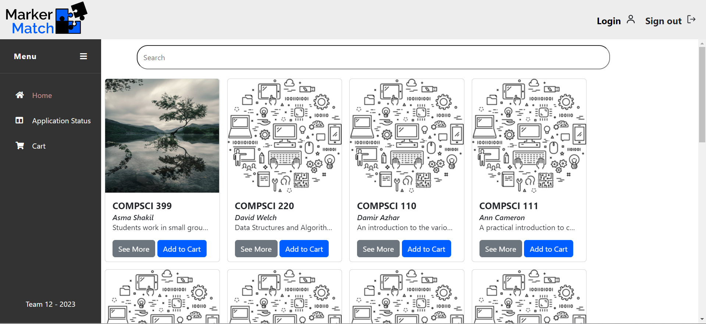
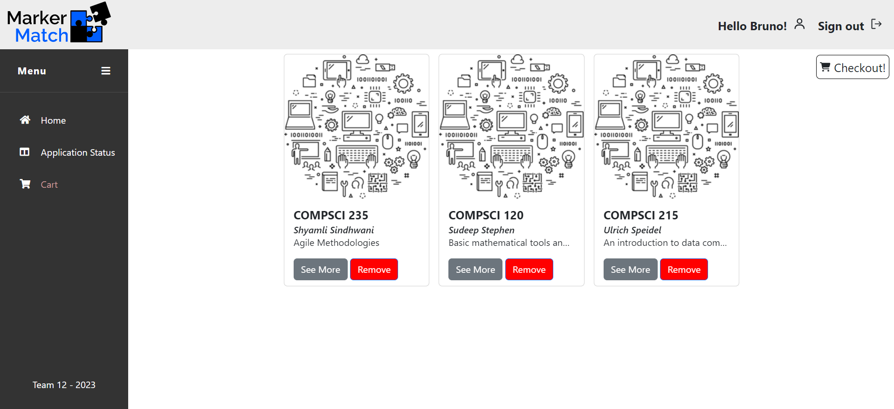
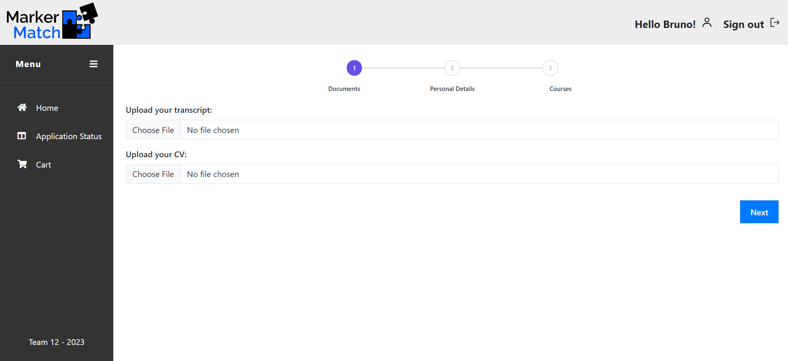
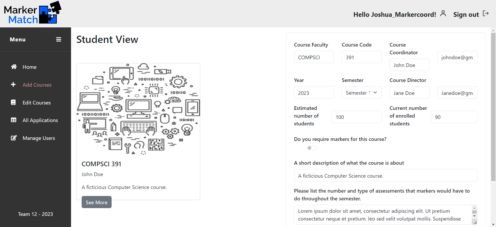
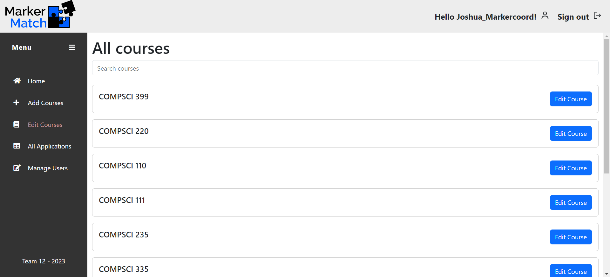
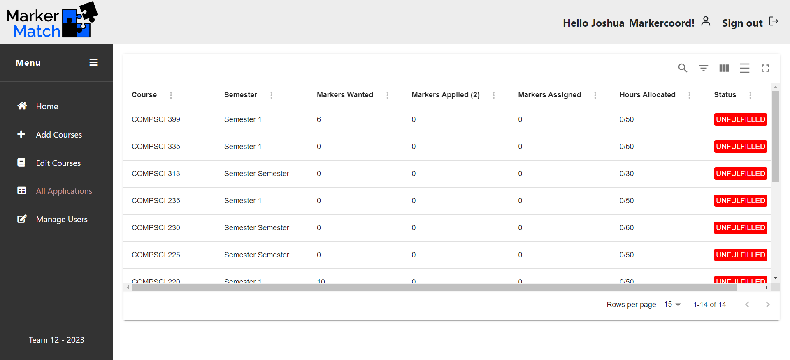
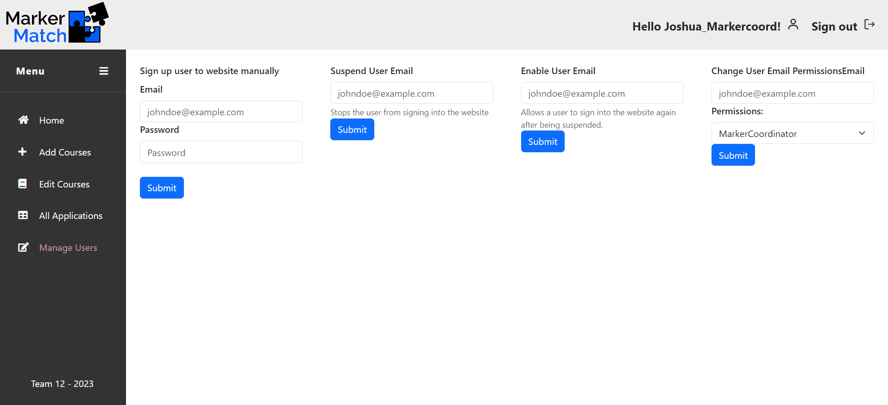

# MarkerMatch

### Deployed at: https://markermatchcapstonelambda12.web.app/home 

## Team Members:
* Nicholas Wu
* Bruno William 
* Matthew Tom
* Joshua Coleman
* Ieva Ruikyte

## Project Description

MarkerMatch is a web application designed to streamline the process of gathering markers for the computer science department at the University of Auckland. It unites students, course coordinators and marker coordinators into one platform. Students can see a catalogue of courses which they can apply to become markers for. Course coordinators can edit the course requirements (of courses for which they are responsible); and marker coordinators have no restrictions. They can see each application, as well as, being able to add, remove and edit each course in the system.

## Planning

Our team used various ways of communicating. One of the main methods of keeping track of work done was used through Trello. For a specific breakdown in tasks, please refer to https://trello.com/b/seMhFLHF/agile-board-compsci-399-lambda-operators-trello.

## Development

### Hosting Technologies:
* AWS EC2 (Default backend)
* AWS Lambda (Serverless backend / relegated backend)
* AWS Amplify (Frontend)
* Firebase (Frontend Deployment)

### Frontend Technologies:
* React v18.2.0

### Backend Technologies:
* JavaScript
  * Nodejs v18.17.1
* AWS RDS (Relational Database Service)
* AWS SDK 
* AWS S3
* AWS Cognito

## Setting Up

* Clone repository to local machine
`git clone https://github.com/uoa-compsci399-s2-2023/capstone-project-team-12.git`
* open command line, navigate to local repository (makesure you are under `markermatch` )
* run `npm install`
* run `amplify pull --appId d2bpa4axdi2900 --envName staging`. Ensure you sign in to an account with team 12 privileges on AWS
* run `npm start`

### Here is an example of the dependencies used in the development of this project. For a full list, please check the package.json file in the project folder.
* @aws-amplify/ui-react: ^5.3.0,
* @aws-sdk/client-cognito-identity-provider: ^3.427.0,
* @aws-sdk/client-sts: 3.427.0,
* @aws-sdk/credential-providers: ^3.427.0,
* @emotion/react: ^11.11.1,
* @fortawesome/react-fontawesome: ^0.2.0,
* @mui/material: ^5.14.9,
* @aws-amplify: ^5.3.11,
* @bootstrap: ^5.3.1,
* @cdbreact: ^1.5.18,
* @react: ^18.2.0

## Application Examples
### Home Page - Entry for all users:

### Application Status page - Applicant view:

### Cart - Applicant View:

### Marker Form Application - Applicant View:
 

 

### Add Courses Page - Marker Coordinator View:

### Edit Courses Page - Marker/Course Coordinator View:

All Applications Page - Marker Coordinator View:

Specific Course Page - Marker Coordinator View:

Manage User - Marker Coordinator View:

## Future Plan (Ideas for future releases)

* Add Dark mode
* Add another view to the table of applicants. Currently, the marker coordinator can see all courses and all the applicants per course. However, the client may want to see all applicants, not just by course.
* Add a filter for courses on the Home page
* A feature to view more information about the applicant in a modal
* Develop a PDF-reader to auto-complete form fields from user transcript and/or CV.
* Develop a Hungarian matching algorithm to identify the best applicants

<!-- # Getting Started with Create React App

This project was bootstrapped with [Create React App](https://github.com/facebook/create-react-app).

## Available Scripts

In the project directory, you can run:

### `npm start`

Runs the app in the development mode.\
Open [http://localhost:3000](http://localhost:3000) to view it in your browser.

The page will reload when you make changes.\
You may also see any lint errors in the console.

### `npm test`

Launches the test runner in the interactive watch mode.\
See the section about [running tests](https://facebook.github.io/create-react-app/docs/running-tests) for more information.

### `npm run build`

Builds the app for production to the `build` folder.\
It correctly bundles React in production mode and optimizes the build for the best performance.

The build is minified and the filenames include the hashes.\
Your app is ready to be deployed!

See the section about [deployment](https://facebook.github.io/create-react-app/docs/deployment) for more information.

### `npm run eject`

**Note: this is a one-way operation. Once you `eject`, you can't go back!**

If you aren't satisfied with the build tool and configuration choices, you can `eject` at any time. This command will remove the single build dependency from your project.

Instead, it will copy all the configuration files and the transitive dependencies (webpack, Babel, ESLint, etc) right into your project so you have full control over them. All of the commands except `eject` will still work, but they will point to the copied scripts so you can tweak them. At this point you're on your own.

You don't have to ever use `eject`. The curated feature set is suitable for small and middle deployments, and you shouldn't feel obligated to use this feature. However we understand that this tool wouldn't be useful if you couldn't customize it when you are ready for it.

## Learn More

You can learn more in the [Create React App documentation](https://facebook.github.io/create-react-app/docs/getting-started).

To learn React, check out the [React documentation](https://reactjs.org/).

### Code Splitting

This section has moved here: [https://facebook.github.io/create-react-app/docs/code-splitting](https://facebook.github.io/create-react-app/docs/code-splitting)

### Analyzing the Bundle Size

This section has moved here: [https://facebook.github.io/create-react-app/docs/analyzing-the-bundle-size](https://facebook.github.io/create-react-app/docs/analyzing-the-bundle-size)

### Making a Progressive Web App

This section has moved here: [https://facebook.github.io/create-react-app/docs/making-a-progressive-web-app](https://facebook.github.io/create-react-app/docs/making-a-progressive-web-app)

### Advanced Configuration

This section has moved here: [https://facebook.github.io/create-react-app/docs/advanced-configuration](https://facebook.github.io/create-react-app/docs/advanced-configuration)

### Deployment

This section has moved here: [https://facebook.github.io/create-react-app/docs/deployment](https://facebook.github.io/create-react-app/docs/deployment)

### `npm run build` fails to minify

This section has moved here: [https://facebook.github.io/create-react-app/docs/troubleshooting#npm-run-build-fails-to-minify](https://facebook.github.io/create-react-app/docs/troubleshooting#npm-run-build-fails-to-minify) -->
